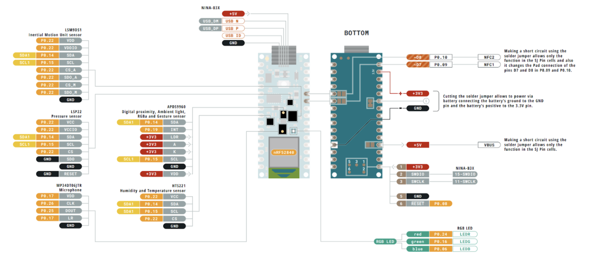
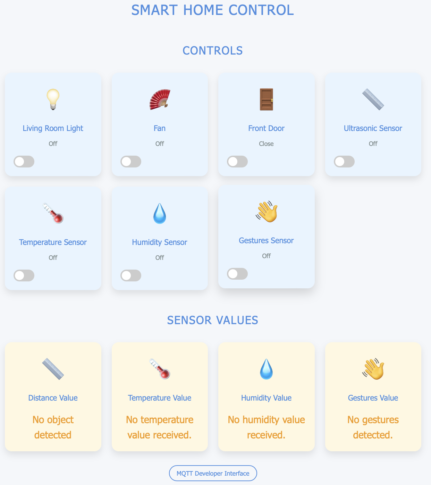

# The Smart Home Magician

**Only works on [Arduino Nano 33 BLE Sense (Rev1)](https://docs.arduino.cc/hardware/nano-33-ble-sense/)**  
**The code is *not* supported on [Arduino Nano 33 BLE Sense (Rev2)](https://docs.arduino.cc/hardware/nano-33-ble-sense-rev2/)**

---

## Overview

The **Smart Home Magician** is a gesture-based home automation system designed to provide an intuitive, hands-free experience. By utilizing gesture recognition technology, this system overcomes the limitations of traditional home automation, eliminating the need for physical controls or voice commands.

---

## Features

- **Gesture Recognition**: Uses machine learning and sensors to recognize hand gestures.
- **Smart Home Control**: Seamlessly controls lighting, temperature, appliances, and more.
- **Wireless Communication**: Supports Bluetooth and Wi-Fi for remote control and efficient data transfer.
- **Environmental Monitoring**: Monitors humidity and temperature for potential automation.
- **User-Friendly Interface**: Designed for accessibility across all ages and abilities.

---

## Hardware Components

### 1. Arduino Nano 33 BLE Sense
- Central processing unit for gesture recognition, sensor data collection, and decision-making.

  
  
  

### 2. ESP32-WROOM-32UE
- Handles Wi-Fi communication and connects the system to external devices and cloud services.

  
  

### 3. Additional Components
- Includes touch sensors, IR receivers/transmitters, relays, buzzers, vibration modules, and LEDs for various inputs/outputs.

---

## Software Libraries

### Arduino Nano 33 BLE Sense
- `ArduinoBLE`
- `Arduino_LSM9DS1`
- `TensorFlowLite`
- `Arduino_HTS221`
- `cmath`
- `Arduino_APDS9960`

### ESP32-WROOM-32UE
- `BLEDevice`
- `BLEUtils`
- `BLEServer`
- `WiFi.h`
- `PubSubClient`

---

## System Architecture

The system consists of two primary modules:

- **Arduino Nano 33 BLE Sense**: Handles sensor data collection, gesture recognition, and device control.
- **ESP32-WROOM-32UE**: Establishes Wi-Fi connectivity and manages MQTT communication for remote control and data exchange with cloud services.

---

## Installation and Setup

### 1. Hardware Assembly
Connect the Arduino Nano 33 BLE Sense, ESP32-WROOM-32UE, and other components as per the circuit diagram.

### 2. Software Setup
- Install the necessary libraries for both Arduino and ESP32.
- Upload the Arduino code to the Arduino Nano 33 BLE Sense.
- Upload the ESP32 code to the ESP32-WROOM-32UE.

### 3. MQTT Broker
Set up an MQTT broker (e.g., Mosquitto) and configure the devices to connect to it.

### 4. Cloud Database (Optional)
Configure a cloud database (e.g., Firebase) for data storage and remote access.

---

## Usage

1. **Power On**: Turn on both the Arduino and ESP32 modules.
2. **Gesture Control**: Use hand gestures to control connected smart home devices.
3. **Remote Control (Optional)**: Use a web or mobile app for remote control via the cloud.
4. **Data Monitoring (Optional)**: Access the cloud database for sensor data monitoring and analysis.

---

## Contributing

Contributions are welcome! If you have ideas, bug fixes, or feature enhancements, please submit a pull request.

---

   
   
   

